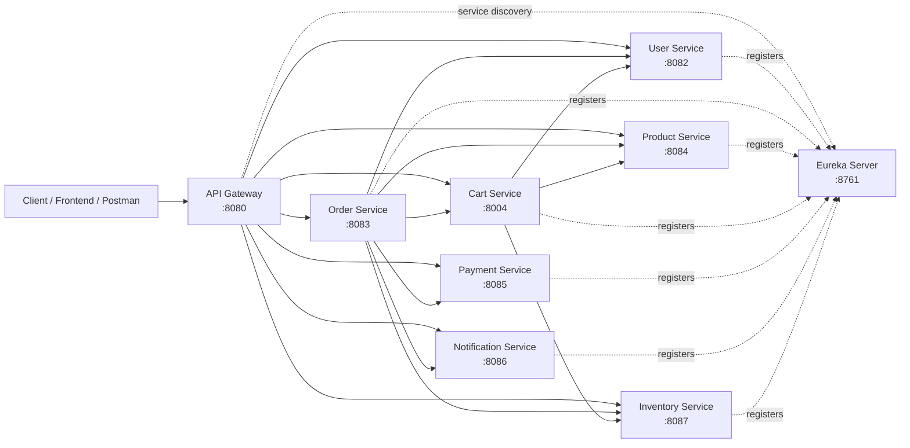
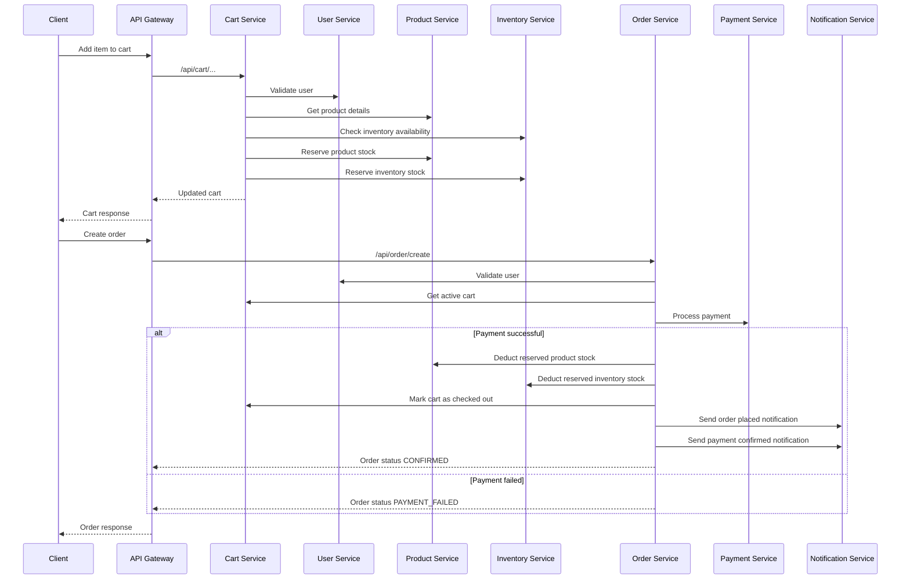
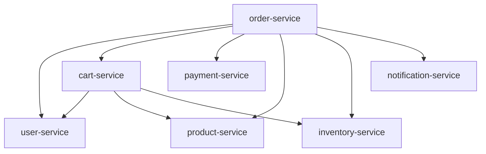

# E-Commerce Backend Architecture

This document reflects the current code structure and service-to-service communication in the repository.

## High-Level Architecture

## Service Communication Map

### External Traffic Flow

- Client requests enter through `api-gateway`
- `api-gateway` routes requests to downstream services using Eureka service discovery
- Route definitions live in `api-gateway/src/main/resources/application.yaml`

### Internal Service-to-Service Calls

#### `order-service`

`order-service` is the main orchestration service for checkout and order placement.

It currently talks to:

- `user-service`
  - validate the user before creating an order
- `cart-service`
  - fetch the active cart
  - mark the cart as completed after successful checkout
- `payment-service`
  - process payment for the order
- `product-service`
  - deduct reserved product stock after payment succeeds
- `inventory-service`
  - deduct inventory stock after payment succeeds
- `notification-service`
  - send order confirmation and payment confirmation notifications

Main implementation:

- `order-service/src/main/java/com/e_commerce_backend/order_service/service/OrderService.java`

#### `cart-service`

`cart-service` is responsible for building the customer's active cart and reserving stock before checkout.

It currently talks to:

- `user-service`
  - validate the user for cart operations
- `product-service`
  - fetch product details such as name and price
  - reserve product stock
  - release product stock
- `inventory-service`
  - check stock availability
  - reserve inventory
  - release inventory

Main implementation:

- `cart-service/src/main/java/com/e_commerce_backend/cart_service/service/CartService.java`

## Current Checkout Flow

## Internal Feign Client Topology

## Responsibilities By Service

| Service | Primary Responsibility | Talks To |
|---|---|---|
| `api-gateway` | Entry point and request routing | All public services through Eureka |
| `eureka-server` | Service registry and discovery | All registered services |
| `user-service` | User management and login | No outbound calls right now |
| `product-service` | Product catalog and product stock reservation | No outbound calls right now |
| `inventory-service` | Inventory availability and stock accounting | No outbound calls right now |
| `cart-service` | Active cart management and stock reservation | `user-service`, `product-service`, `inventory-service` |
| `payment-service` | Payment processing | No outbound calls right now |
| `notification-service` | Notification delivery | No outbound calls right now |
| `order-service` | Checkout orchestration and order lifecycle | `user-service`, `cart-service`, `payment-service`, `product-service`, `inventory-service`, `notification-service` |

## Notes About The Current Codebase

- Service discovery is configured through Eureka using service names like `user-service`, `order-service`, and `cart-service`
- Internal service APIs are exposed under `/internal/**` paths so Feign calls can work without user JWT enforcement
- `order-service` is currently the main orchestration boundary for checkout
- `cart-service` handles reservation behavior before payment
- The runtime architecture in code is broader than the current `docker-compose.yml`
  - the compose file still does not start all business services and databases

## Recommended Next Improvements

- Add all services and PostgreSQL instances to `docker-compose.yml`
- Add distributed tracing or correlation IDs between gateway and services
- Introduce circuit breakers and fallback handling for Feign clients
- Move from synchronous notifications to event-driven messaging for order and payment events
- Add shared API contracts or OpenAPI specs for internal endpoints
